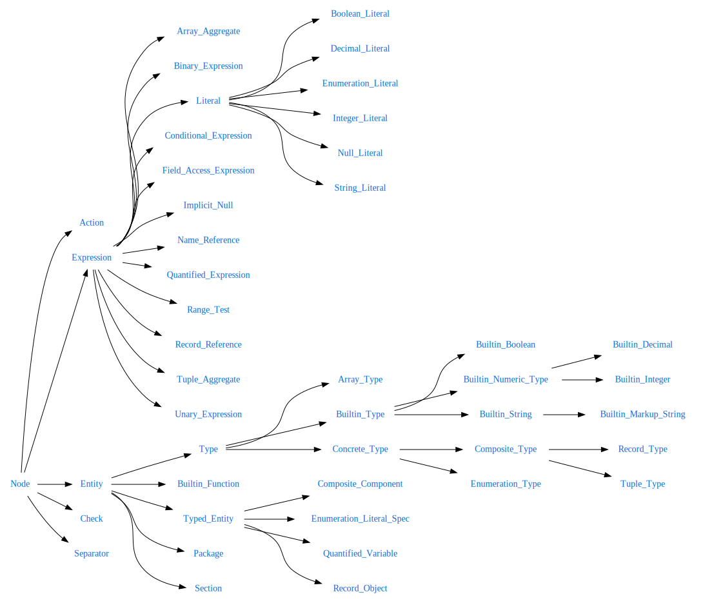

# TRLC Architecture

This document is a (somewhat minimal) documentation of how the tools
work and why certain design decisions were made. It is required
reading if you want to contribute to the code base or language design.

It is assumed that the reader understand basic compiler design, if not
then the [dragon
book](https://en.wikipedia.org/wiki/Compilers:_Principles,_Techniques,_and_Tools)
is a good place to start.

## Coding style

Most of these are checked with `make lint`. Generally normal Python,
with some changes:

* Class names follow Ada naming convention (e.g. LASER_Is_An_Acronym)
* Methods are lowercase with underscores (e.g. eat_potato)
* Just use simple `%` string formatting
* Horizontal alignment where reasonable, for example

  ```python
  x = {
    "potatos" : 12,
    "cats"    : 3,
  }
  ```

* Asserts for the types of all parameters (except self), for all
  functions or methods, all the time, e.g:

  ```python
  def do_something(self, other, thing=None):
      assert isinstance(thing, str) or thing is None
	  assert isinstance(other, Some_Object)
  ```

* Avoid throwing or catching exceptions, unless there is no reasonable
  alternative. Instead write code that works. :) An exception here is
  the actual error mechanism of TRLC, but again there just use the
  provided interface, never raise your own exceptions.

## Tool architecture

### Files

The main files are:

* [trlc.py](../trlc/trlc.py) The main entry point and the
  Source_Manager
* [errors.py](../trlc/errors.py) The single place to generate _any_
  message produced by the tools. Defines Message_Handler (the API to
  create messages) and Location (a way to point to a specific place in
  input sources).
* [lexer.py](../trlc/lexer.py) Defines the Token type and implements a
  lexer for the TRLC language.
* [parser.py](../trlc/parser.py) Implements parsers for the TRLC
  language and the Markup_String embedded language.
* [ast.py](../trlc/ast.py) Defines the AST. Refer to
  [ast_hierarchy](ast_hierarchy.svg) for a visual overview of this.
* [lint.py](../trlc/lint.py) Implements a linter operating on the TRLC
  AST.
* [vcg.py](../trlc/vcg.py) Used by the linter to prove absence of
  run-time errors on user-defined checks.

There are also a few utility files:

* [version.py](../trlc/version.py) Defines the current tool version.
* [nested.py](../trlc/nested.py) Used for creating sub-parses for
  languages embedded in TRLC strings.
* [math.py](../trlc/math.py) Implements the integer remainder function
  (it's not the same as Python `%`) and the rounding function for
  decimal to integer conversions.

### Overall dataflow
The TRLC tool is actually two tools (the evaluator and the linter),
however there is significant overlap in dataflow.

* A shared command-line interface in [trlc.py](../trlc/trlc.py)
  determines the file set to process and mode of operation (normal
  evaluation or analysis with `--lint`).

* The Source_Manager registers files and decides on the parse
  order. For all modes of operation all `.rsl` files are parsed first,
  and then all `.check` files.

* Then in `--lint` mode the [lint.py](../trlc/lint.py) and
  [vcg.py](../trlc/vcg.py) modules are used to sanity check types and
  user checks, and we then stop with messages and a return code of 0
  or 1.

* Otherwise in normal mode the Source_Manager proceeds to parse all
  `.trlc` files.

* Afterwards any missing references (i.e. references from things
  declared in one file to things declared in another file) are
  resolved.

* Then all user defined check are evaluated. This is implemented as a
  tree-walk through the perform_checks function in
  [ast.py](../trlc/ast.py).

At this point the command-line tool stops; but when the Source_Manager
is invoked from the API then the final symbol table is passed on to
the user.

### Errors and Locations

There is a single class, Location, an instance of which is attached to
every single node in the AST, and every single token generated by
parser.

If you want to create a message of any kind, there is a single way to
do it. You need to have a reference to the Message_Handler (usually
called `mh` in the code).

You then call `mh.warning`, `mh.check`, `mh.error`, `mh.ice_loc` to
create a message. The intended semantics of these are:

* `warning` should be called for issues that are not outright banned
  by the LRM, but are problematic nonetheless. For example duplicate
  imports.

* `check` should be called for user-defined checks or for lint
  discovered problems.

* `error` should be called for lexing issues, syntax error, and other
  static violations of language rules.

* `ice_loc` generates an internal compiler error and hard aborts the
  tool execution. Think of this as an assert that should never fail,
  but if it does something is truly broken. There should be no way to
  actually execute this.

For example:

```python
if t_previous.value == t_import.value:
   mh.warning(t_import.location,
              "duplicate import of package %s" % t_import.value)
   return
```

This generates on a useful and rich message:

```plain
import Foo
       ^^^ duplicate-imports/bar.trlc:4: warning: duplicate import of package Foo
```

Note that you don't have to worry about all the fancy pointing or
reproduction of source text; the Message_Handler will do that for you.

The `mh.error` method has an optional attribute `fatal` (true by
default). If set then after creating the error an exception of type
`TRLC_Error` is raised.

The tool catches this exception at the top-level, there should be no
other place where this is caught.

### Lexer

The lexer is a hand-crafted lexer. We have chosen to do this over
e.g. using PLY because:

* No dependencies
* Very precise error location generation was a very important
  criteria. It is possible to do this with PLY but it's a major
  hassle.

The lexer is not using the `re` module, instead it considers a sliding
window of 3 characters without back-tracking.

The only reason the window is 3 characters instead of just 2 is the
`..` operator for ranges. We need to be able to distinguish between
`1.2` and `1..2`.

### Parser

The parser is a hand-crafted recursive descent parser. Again, we do
not want to use a generated parser like PLY or AntLR because:

* No dependencies
* Performance (especially when compared to AntLR)
* Emphasis on creating as much of the semantic resolution as early as
  possible when generating the AST.
* Better error messages that come naturally with a recursive descent
  parser.

The parser considers only considers a single token look-ahead.

The naming of parse methods generally follows the naming of
non-terminals in the BNF grammar, e.g. `parse_qualified_name` for
parsing the qualified_name non-terminal.

In general symbols are immediately resolved to their entities, there
are in general no unresolved references, except in two very specific
cases:

* References to record object in general are resolved late, because we
  need to parse all files in order to know which ones actually exist.
* In the `parse_name` method we delay lookup until we know what we're
  supposed to be looking for. The main culprit here is the builtin
  functions; a record may have a field called `len` and we won't know
  if we should look into the record symbol table or the global symbol
  table until we encounter the `(`.

Speaking of symbol tables, the design of TRLC here mirrors the
philosophy from the GNAT Ada compiler: there is no central symbol
table, instead everything is a tree and some nodes have "symbol
tables" attached to them.

For example an `Enumeration_Type` has a mini table that stores all its
literals; and in turn this type is in the mini table of its
`Package`. Only the package is stored in the global symbol table
(which is provided by the `Source_Manager`).

You can visualise the AST by using the `--debug-dump` option of the
tools. For this file:

```trlc
package Test2

type T2 {
  x Integer
}

checks T2 {
  x > 1, fatal "must be positive", x
  x != 0, warning "potato"
}
```

It generates something like this:

```plain
Symbol_Table
   Builtin_Integer
   Builtin_Decimal
   Builtin_Boolean
   Builtin_String
   Builtin_Markup_String
   Builtin_Function trlc:len
   Builtin_Function trlc:startswith
   Builtin_Function trlc:endswith
   Builtin_Function trlc:matches
   Builtin_Function len
   Builtin_Function startswith
   Builtin_Function endswith
   Builtin_Function matches
   Package Test2
      Declared_Late: False
      Record_Type T2
         Composite_Component x
            Optional: False
            Type: Integer
         Checks
            Fatal error 'must be positive'
               Anchor: x
               Binary Binary_Operator.COMP_GT Expression
                  Type: Boolean
                  Name Reference to x
                  Integer Literal 1
            Warning 'potato'
               Binary Binary_Operator.COMP_NEQ Expression
                  Type: Boolean
                  Name Reference to x
                  Integer Literal 0
```

### The AST

The most useful entry point here is the hierarchy picture:



Only leaf nodes can be created.

The AST is especially picky with its assertions. Each node carries in
its constructor very specific assumptions about the type of it's
children. For example:

```python
class Quantified_Expression(Expression):
    def __init__(self, mh, location,
                 typ,
                 universal,
                 n_variable,
                 n_source,
                 n_expr):
        super().__init__(location, typ)
        assert isinstance(typ, Builtin_Boolean)
        assert isinstance(universal, bool)
        assert isinstance(n_variable, Quantified_Variable)
        assert isinstance(n_expr, Expression)
        assert isinstance(n_source, Name_Reference)
        self.universal = universal
        self.n_var     = n_variable
        self.n_expr    = n_expr
        self.n_source  = n_source
        self.n_expr.ensure_type(mh, Builtin_Boolean)
```

For example instead of asserting that n_source is an Expression, or
even Node; we are very precise here in what we require.

Similarly, functions that add or set things, also must be very
specific. For example:

```python
    def add_item(self, node):
        assert isinstance(node, (Concrete_Type,
                                 Check_Block,
                                 Record_Object))
        self.items.append(node)
```
