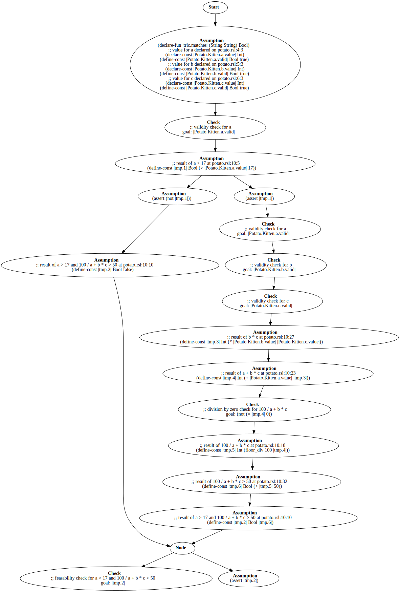

# TRLC Architecture

This document is a (somewhat minimal) documentation of how the tools
work and why certain design decisions were made. It is required
reading if you want to contribute to the code base or language design.

It is assumed that the reader understand basic compiler design, if not
then the [dragon
book](https://en.wikipedia.org/wiki/Compilers:_Principles,_Techniques,_and_Tools)
is a good place to start.

## Coding style

Most of these are checked with `make lint`. Generally normal Python,
with some changes:

* Class names follow Ada naming convention (e.g. LASER_Is_An_Acronym)
* Methods are lowercase with underscores (e.g. eat_potato)
* Just use simple `%` string formatting
* Horizontal alignment where reasonable, for example

  ```python
  x = {
    "potatos" : 12,
    "cats"    : 3,
  }
  ```

* Asserts for the types of all parameters (except self), for all
  functions or methods, all the time, e.g:

  ```python
  def do_something(self, other, thing=None):
      assert isinstance(thing, str) or thing is None
	  assert isinstance(other, Some_Object)
  ```

* Avoid throwing or catching exceptions, unless there is no reasonable
  alternative. Instead write code that works. :) An exception here is
  the actual error mechanism of TRLC, but again there just use the
  provided interface, never raise your own exceptions.

## Tool architecture

### Files

The main files are:

* [trlc.py](../trlc/trlc.py) The main entry point and the
  Source_Manager
* [errors.py](../trlc/errors.py) The single place to generate _any_
  message produced by the tools. Defines Message_Handler (the API to
  create messages) and Location (a way to point to a specific place in
  input sources).
* [lexer.py](../trlc/lexer.py) Defines the Token type and implements a
  lexer for the TRLC language.
* [parser.py](../trlc/parser.py) Implements parsers for the TRLC
  language and the Markup_String embedded language.
* [ast.py](../trlc/ast.py) Defines the AST. Refer to
  [ast_hierarchy](ast_hierarchy.svg) for a visual overview of this.
* [lint.py](../trlc/lint.py) Implements a linter operating on the TRLC
  AST.
* [vcg.py](../trlc/vcg.py) Used by the linter to prove absence of
  run-time errors on user-defined checks.

There are also a few utility files:

* [version.py](../trlc/version.py) Defines the current tool version.
* [nested.py](../trlc/nested.py) Used for creating sub-parses for
  languages embedded in TRLC strings.
* [math.py](../trlc/math.py) Implements the integer remainder function
  (it's not the same as Python `%`) and the rounding function for
  decimal to integer conversions.

### Overall dataflow
The TRLC tool is actually two tools (the evaluator and the linter),
however there is significant overlap in dataflow.

* A shared command-line interface in [trlc.py](../trlc/trlc.py)
  determines the file set to process and mode of operation (normal
  evaluation or analysis with `--lint`).

* The Source_Manager registers files and decides on the parse
  order. For all modes of operation all `.rsl` files are parsed first,
  and then all `.check` files.

* Then in `--lint` mode the [lint.py](../trlc/lint.py) and
  [vcg.py](../trlc/vcg.py) modules are used to sanity check types and
  user checks, and we then stop with messages and a return code of 0
  or 1.

* Otherwise in normal mode the Source_Manager proceeds to parse all
  `.trlc` files.

* Afterwards any missing references (i.e. references from things
  declared in one file to things declared in another file) are
  resolved.

* Then all user defined check are evaluated. This is implemented as a
  tree-walk through the perform_checks function in
  [ast.py](../trlc/ast.py).

At this point the command-line tool stops; but when the Source_Manager
is invoked from the API then the final symbol table is passed on to
the user.

### Errors and Locations

There is a single class, Location, an instance of which is attached to
every single node in the AST, and every single token generated by
parser.

If you want to create a message of any kind, there is a single way to
do it. You need to have a reference to the Message_Handler (usually
called `mh` in the code).

You then call `mh.warning`, `mh.check`, `mh.error`, `mh.ice_loc` to
create a message. The intended semantics of these are:

* `warning` should be called for issues that are not outright banned
  by the LRM, but are problematic nonetheless. For example duplicate
  imports.

* `check` should be called for user-defined checks or for lint
  discovered problems.

* `error` should be called for lexing issues, syntax error, and other
  static violations of language rules.

* `ice_loc` generates an internal compiler error and hard aborts the
  tool execution. Think of this as an assert that should never fail,
  but if it does something is truly broken. There should be no way to
  actually execute this.

For example:

```python
if t_previous.value == t_import.value:
   mh.warning(t_import.location,
              "duplicate import of package %s" % t_import.value)
   return
```

This generates on a useful and rich message:

```plain
import Foo
       ^^^ duplicate-imports/bar.trlc:4: warning: duplicate import of package Foo
```

Note that you don't have to worry about all the fancy pointing or
reproduction of source text; the Message_Handler will do that for you.

The `mh.error` method has an optional attribute `fatal` (true by
default). If set then after creating the error an exception of type
`TRLC_Error` is raised.

The tool catches this exception at the top-level, there should be no
other place where this is caught.

### Lexer

The lexer is a hand-crafted lexer. We have chosen to do this over
e.g. using PLY because:

* No dependencies
* Very precise error location generation was a very important
  criteria. It is possible to do this with PLY but it's a major
  hassle.

The lexer is not using the `re` module, instead it considers a sliding
window of 3 characters without back-tracking.

The only reason the window is 3 characters instead of just 2 is the
`..` operator for ranges. We need to be able to distinguish between
`1.2` and `1..2`.

### Parser

The parser is a hand-crafted recursive descent parser. The parser
considers only considers a single token look-ahead. Again, we do not
want to use a generated parser like PLY or AntLR because:

* No dependencies
* Performance (especially when compared to AntLR)
* Emphasis on creating as much of the semantic resolution as early as
  possible when generating the AST.
* Better error messages that come naturally with a recursive descent
  parser.
* Two-stage parsing (see below).

Parsing is a bit weird for `.rsl` and `.trlc` files due to the import
mechanism. When the `Source_Manager` first registers a `.rsl` file we
immediately parse the
[file_preamble](https://bmw-software-engineering.github.io/trlc/lrm.html#lrm-Preamble)
to understand dependencies and determine a parse order. When we parse
the `.trlc` files we again parse them in two parts: first we pre-parse
the preamble for all files; and then in a second step we parse the
rest of all files.

The naming of parse methods generally follows the naming of
non-terminals in the BNF grammar, e.g. `parse_qualified_name` for
parsing the qualified_name non-terminal.

In general symbols are immediately resolved to their entities, there
are in general no unresolved references, except in two very specific
cases:

* References to record object in general are resolved late, because we
  need to parse all files in order to know which ones actually exist.
* In the `parse_name` method we delay lookup until we know what we're
  supposed to be looking for. The main culprit here is the builtin
  functions; a record may have a field called `len` and we won't know
  if we should look into the record symbol table or the global symbol
  table until we encounter the `(`.

Speaking of symbol tables, the design of TRLC here mirrors the
philosophy from the GNAT Ada compiler: there is no central symbol
table, instead everything is a tree and some nodes have "symbol
tables" attached to them.

For example an `Enumeration_Type` has a mini table that stores all its
literals; and in turn this type is in the mini table of its
`Package`. Only the packages are stored in the global symbol table
(which is provided by the `Source_Manager`).

You can visualise the AST by using the `--debug-dump` option of the
tools. For this file:

```trlc
package Test2

type T2 {
  x Integer
}

checks T2 {
  x > 1, fatal "must be positive", x
  x != 0, warning "potato"
}
```

It generates something like this:

```plain
Symbol_Table
   Builtin_Integer
   Builtin_Decimal
   Builtin_Boolean
   Builtin_String
   Builtin_Markup_String
   Builtin_Function trlc:len
   Builtin_Function trlc:startswith
   Builtin_Function trlc:endswith
   Builtin_Function trlc:matches
   Builtin_Function len
   Builtin_Function startswith
   Builtin_Function endswith
   Builtin_Function matches
   Package Test2
      Declared_Late: False
      Record_Type T2
         Composite_Component x
            Optional: False
            Type: Integer
         Checks
            Fatal error 'must be positive'
               Anchor: x
               Binary Binary_Operator.COMP_GT Expression
                  Type: Boolean
                  Name Reference to x
                  Integer Literal 1
            Warning 'potato'
               Binary Binary_Operator.COMP_NEQ Expression
                  Type: Boolean
                  Name Reference to x
                  Integer Literal 0
```

### The AST

The most useful entry point here is the hierarchy picture:


Only leaf nodes can be created.

The AST is especially picky with its assertions. Each node carries in
its constructor very specific assumptions about the type of it's
children. For example:

```python
class Quantified_Expression(Expression):
    def __init__(self, mh, location,
                 typ,
                 universal,
                 n_variable,
                 n_source,
                 n_expr):
        super().__init__(location, typ)
        assert isinstance(typ, Builtin_Boolean)
        assert isinstance(universal, bool)
        assert isinstance(n_variable, Quantified_Variable)
        assert isinstance(n_expr, Expression)
        assert isinstance(n_source, Name_Reference)
        self.universal = universal
        self.n_var     = n_variable
        self.n_expr    = n_expr
        self.n_source  = n_source
        self.n_expr.ensure_type(mh, Builtin_Boolean)
```

For example instead of asserting that n_source is an Expression, or
even Node; we are very precise here in what we require.

Similarly, functions that add or set things, also must be very
specific. For example:

```python
    def add_item(self, node):
        assert isinstance(node, (Concrete_Type,
                                 Check_Block,
                                 Record_Object))
        self.items.append(node)
```

Other than this the AST is pretty boring; there is no rewriting or
simplification. The only node worth pointing out as special is
`Name_Reference`, as that is the only node where the entity it refers
to may be filled in late.

## Evaluation

Evaluation of expressions is a major component of the language. Each
`Expression` node has a function evaluate:

```
    def evaluate(self, mh, context):
        assert isinstance(mh, Message_Handler)
        assert context is None or isinstance(context, dict)
```

The context is a mapping of local names to values, this is used when
evaluating a user defined check to bind the component names used in
the check to concrete values.

The context can be None, in which case evaluation fails with "cannot
be used in a static context" if the expression is not static. This
used in a few places to enforce static values:

* The right-hand side of the power operator must be static
* The regular expression given to matches must be static

Evaluation in general is using Value (also defined in ast.py) as a
polymorphic nullable value. Each individual evaluation method is
responsible for the appropriate type checking; this is not delegated
to the Value class (which is really just a container). The Value class
has a type (typ) and value. The type is an instance of the node type
`Type` (e.g. `Builtin_Integer` or `Record_Type`).

The value is a python value representing it, or None (for null
values).

* `str` (for `Builtin_String` or `Builtin_Markup_String`)
* `int` (for `Builtin_Integer`)
* `bool` (for `Builtin_Boolean`)
* `list` of `Value` (for `Array_Type`)
* `dict` of `str` -> `Value` (for `Tuple_Aggregate`)
* `fractions.Fraction` (for `Builtin_Decimal`)
* `Record_Reference` (for `Record_Type`; i.e. we store the reference
  itself not the object referred to)
* `Enumeration_Literal_Spec` (for `Enumeration_Type`)

Evaluation itself is pretty simple, we just apply the relevant python
operator or something from math.py. For example for the unary
operators:

```python
    def evaluate(self, mh, context):
        assert isinstance(mh, Message_Handler)
        assert context is None or isinstance(context, dict)

        v_operand = self.n_operand.evaluate(mh, context)
        if v_operand.value is None:
            mh.error(v_operand.location,
                     "input to unary expression %s (%s) must not be null" %
                     (self.to_string(),
                      mh.cross_file_reference(self.location)))

        if self.operator == Unary_Operator.MINUS:
            return Value(location = self.location,
                         value    = -v_operand.value,
                         typ      = self.typ)
        elif self.operator == Unary_Operator.PLUS:
			...
```

There is a big assumption made here, in that the tree is correctly
formed (in terms of typ), but this is statically checked at
construction. This is why we don't typecheck when we evaluate unary
minus, but just rely on / assume that the value will be an integer or
fraction.

In evaluation there are (currently) three places where run-time errors
can be created:

* Evaluation of null in any context other than equality (or
  inequality).
* Division by zero (both integers and decimals).
* Array out-of-bounds.

Here is a good place to explain a design decision regarding the null
rules of the language and why `null` is only allowed in a very
specific context.

Every expression is typed, and null should have the correct type,
i.e. if we say `1 == null` then the null should be an
`Builtin_Integer` null. However we also do not want to do multiple
passes over the parse-tree to do type resolution (e.g. like Ada), and
so expressions like `(if a then null elseif (...) else null)` would be
infuriating to deal with.

Name references that happen to be null are not an issue, because we
always know the type they are supposed to be. For `null` we don't
actually do this (have a polymorphic null), instead we have a
`Null_Literal` that has no type, and then we just restrict the places
it can appear.

This effectively dodges the issue, without any real loss of generality
in the language; and we can parse everything in one pass and resolve
all types immediately.

## Linter

There are two parts to the linter; the classical static analysis part
"linter" (in [lint.py](../trlc/lint.py)) and the more formal methods
based analysis "verification condition generation" (in
[vcg.py](../trlc/vcg.py).

The traditional linter is pretty simple: after parsing everything we
do another tree-walk and emit additional messages.

There are a few exceptions, as some problems are best detected when
parsing for the first time. Hence the `Parser` has a attribute
`lint_mode` that can enable additional messages in this case. However
a design goal in general is separation of concerns, so this method is
only chosen if the alternative would be impossible or extremely
awkward to do.

An example is the lint check for clarifying final. In the AST we just
know if a record is final or not, we do not know if this was
inherited, or if the keyword was present. In the parser we do. We
could of course modify the AST to record this, but that is generally
not helpful since nobody else (currently) cares if this attribute was
there or not.

The linter itself is simple and reading the code should make it
obvious how it works. The only important design goal is to try and
implement new checks in lint.py and not parser.py, if at all possible.

## Verification condition generation

Once other lint checks have been performed, the linter constructs an
object of class `VCG` (from [vcg.py](../trlc/vcg.py)) for record types
and tuple types, and calls the analysis method. This intends to find
deeper problems with the user types and rules.

The overall approach is to encode a model of our source language in
[SMTLIB](http://smtlib.cs.uiowa.edu/about.shtml) and feed these
problems to an [SMT
Solver](https://en.wikipedia.org/wiki/Satisfiability_modulo_theories). Depending
on how the solver answers, we can then issue messages informing the
user about problems.

This feature is gated behind the `--verify` option, as it requires two
additional run-time dependencies:

* PyVCG [(Github)](https://github.com/florianschanda/PyVCG)
  [(PyPI)](https://pypi.org/project/PyVCG/) (for building the SMTLIB
  problems)
* CVC5 [(Github)](https://github.com/cvc5/cvc5)
  [(PyPI)](https://pypi.org/project/cvc5/) (for solving the SMTLIB
  problems)

### Terminology

First some terminology that we shall be using:

* VC: a **V**erification **C**ondition. This is a small logical
  problem where we have known facts (e.g. `x > 10`) followed by a
  conclusion we want to prove (e.g. `x != 0`). Generally we generate a
  number of verification conditions for an expression / program /
  function, and if we manage to prove *all* of them, then we can
  conclude something (e.g. "we don't crash" or "we don't divide by
  zero").
* Path: a possible execution trace through an expression or program
* Sound: a property of an analysis. A sound analysis has no false
  positives, i.e. it does not miss bugs.
* Complete: a property of an analysis. A complete analysis has no
  false alarms, i.e. all messages raised really do correspond to a
  problem.
* Automatic: a property of an analysis. An automatic analysis does not
  require human intelligence or input.
* SAT: **SAT**isfiable, i.e. there is an assignment to a formula that
  makes it true. For example `x >= 0 and x <= 10` is SAT, since `x =
  3` would make the entire thing true.
* UNSAT: **UNSAT**isfiable, i.e. there is no assignment to a formula
  that makes it true. For example `x == 1 and x == 2` is UNSAT, since
  there is no possible value for `x` that would make both equalities
  true.

### Example

We shall explain the overall process based on a trivial example:

```trlc
package Potato

type Kitten {
  a Integer
  b Integer
  c Integer
}

checks Kitten {
  a > 17 and 100 / (a + b * c) > 50, warning "Example"
}
```

In this case there are no null derefence problems, but there is a
potential division by zero.

First we need to understand how many possible execution paths there
are through this:

* The warning is raised
  * (1) Both `a > 17` and `100 / (a + b * c)` are true
* The warning is not raised
  * (2) `a <= 17` (in which case we do not care about the rest, as the
    and operator has [short-cut
    semantics](https://bmw-software-engineering.github.io/trlc/lrm.html#lrm-Shortcut_Logical_Operators).
  * (3) `a > 17` and `100 / (a + b * c)` is false

So here only path (1) and (3) is exciting, since those are the paths
where we can get to the division. Path (2) can never raise a division
by zero error, if the implementation follows the LRM.

One of the features of PyVCG is that we can build a graph that models
the execution paths of the source language; and we can then ask it to
build VCs for all possible paths. The graph for this looks like this:



We start at the top. First we need to introduce the things we talk
about (these are the components of our record).

```lisp
;; value for a declared on potato.rsl:4:3
(declare-const |Potato.Kitten.a.value| Int)
(define-const |Potato.Kitten.a.valid| Bool true)
;; value for b declared on potato.rsl:5:3
(declare-const |Potato.Kitten.b.value| Int)
(define-const |Potato.Kitten.b.valid| Bool true)
;; value for c declared on potato.rsl:6:3
(declare-const |Potato.Kitten.c.value| Int)
(define-const |Potato.Kitten.c.valid| Bool true)
```

First note that SMTLIB should be read like LISP: `(` function
operators+ `)`. This means in the first line we declare a constant
(the SMT term for a free variable) by using the `declare-const`
function, and it's arguments are `|Potato.Kitten.a.value|` (i.e. the
name of this constant) and `Int` (i.e. it's type, or sort in SMT).

We have two constants that we use to model each record field: One for
the actual value, and one indicating if it's null or not. Since all
fields are not optional, all of them are already defined to be
`true`. Note that for the values we didn't do this, since we want the
solver to figure out what they could be.

Moving to the next node in the graph we see:

```lisp
;; validity check for a
goal: |Potato.Kitten.a.valid|
```

This corresponds to the very first use of a in our expression:

```
  a > 17 and 100 / (a + b * c) > 50, warning "Example"
  ^ this one right here
```

We need to check if this `a` could possibly be null. It's kinda
obvious, but we need to do it anyway.

So we now want to get an SMT solver to figuire out if
`|Potato.Kitten.a.valid|` is always true, in every possible instance
of this record.

To do that is that we *negate* the goal and ask if there is a SAT
assignment. Because if we can find one, the goal is obviously not
always true, and even better we have a *counter-example* we can give
to the user. If the problem turns out to be UNSAT, then we can
conclude by the law of excluded middle, that the original statement
must be always true.

The complete VC for this check looks like this:

(We have removed the matches function from this, because it's not
relevant and we'll explain it later.)

```
(set-logic QF_UFLIA)
(set-option :produce-models true)

;; value for a declared on potato.rsl:4:3
(declare-const |Potato.Kitten.a.value| Int)
(define-const |Potato.Kitten.a.valid| Bool true)
;; value for b declared on potato.rsl:5:3
(declare-const |Potato.Kitten.b.value| Int)
(define-const |Potato.Kitten.b.valid| Bool true)
;; value for c declared on potato.rsl:6:3
(declare-const |Potato.Kitten.c.value| Int)
(define-const |Potato.Kitten.c.valid| Bool true)
;; validity check for a
(assert (not |Potato.Kitten.a.valid|))
(check-sat)
(get-value (|Potato.Kitten.a.value|))
(get-value (|Potato.Kitten.a.valid|))
(get-value (|Potato.Kitten.b.value|))
(get-value (|Potato.Kitten.b.valid|))
(get-value (|Potato.Kitten.c.value|))
(get-value (|Potato.Kitten.c.valid|))
(exit)
```

Note: You can see these files if you use the `--debug-vcg` option.

If we now feed this to a solver, we will immediately get an UNSAT
result.

After this check we can proceed to the next step. We can compute a
value for the result of `a > 17`.

```lisp
;; result of a > 17 at potato.rsl:10:5
(define-const |tmp.1| Bool (> |Potato.Kitten.a.value| 17))
```

Here we store this in a new (intermediate) constant we define just for
this purpose. This activity is not unlike SSA (static single
assignment) that is a common step in compilers.

We then introduce a branch. In the left hand side we assert that `not
|tmp.1|` is true, and in the right-hand side we assert that `|tmp.1|` is true. This models the and semantics, where we do not proceed to the right-hand side if the left-hand side is false.

We then continue adding more validity checks (for `a` (again), and
also for `b` and `c`). You might think it would be good to not check
for `a` again, but generally VCG is hard enough as it is, and such
optimisations are more likely to introduce errors than not. So we
leave this for much later if it turns out to be a real problem.

Afterwards we define intermediates for `b * c` (tmp.3) and then `a +
tmp.3` (tmp.4). We then need to check if this could be zero. So again
we assert that it's not and ask for an assignment:

```lisp
(define-const |tmp.1| Bool
  (> |Potato.Kitten.a.value| 17))
(assert |tmp.1|)

;; result of b * c at potato.rsl:10:27
(define-const |tmp.3| Int
  (* |Potato.Kitten.b.value| |Potato.Kitten.c.value|))

;; result of a + b * c at potato.rsl:10:23
(define-const |tmp.4| Int
  (+ |Potato.Kitten.a.value| |tmp.3|))

;; division by zero check for 100 / a + b * c
(assert (not (not (= |tmp.4| 0))))
(check-sat)
```

The `not not` seems surprising, but again it's just easier this
way. What we want to be true is `tmp.4 != 0`, this translates to `(not
(= |tmp.4| 0))`. So that is our goal, and to find out if the goal is
always true we negate it. So `(not (not ...`.

And now we get a SAT result, with an assignment:

```plain
$ cvc5 trlc-Potato-Kitten_0002.smt2
sat
((Potato.Kitten.a.value 18))
((Potato.Kitten.a.valid true))
((Potato.Kitten.b.value 2))
((Potato.Kitten.b.valid true))
((Potato.Kitten.c.value (- 9)))
((Potato.Kitten.c.valid true))
```

So now we have a counter-example and we can feed this back to the user:

```plain
a > 17 and 100 / (a + b * c) > 50, warning "Example"
               ^ potato.rsl:10: warning: divisor could be 0 [vc_id = 2] [vcg-div-by-zero]
               | example record_type triggering error:
               |   Kitten bad_potato {
               |     a = 18
               |     b = 2
               |     c = -9
               |   }
```
